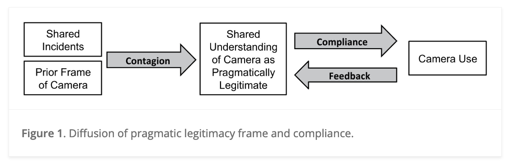
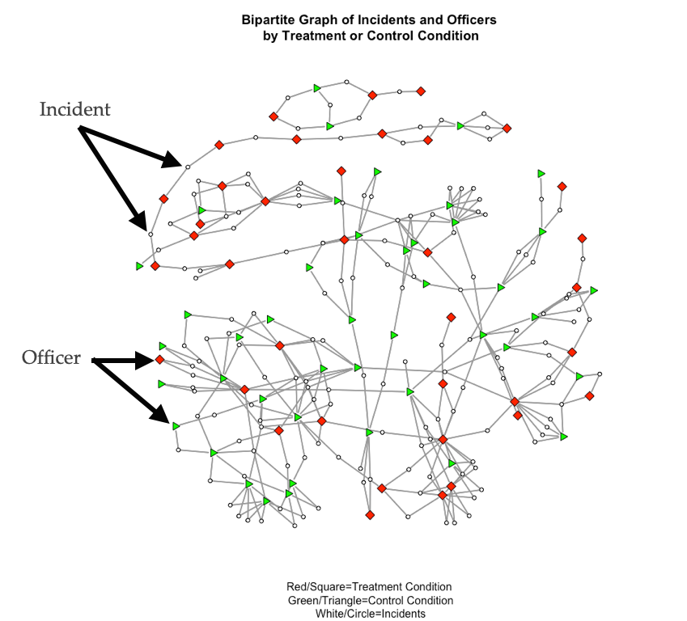
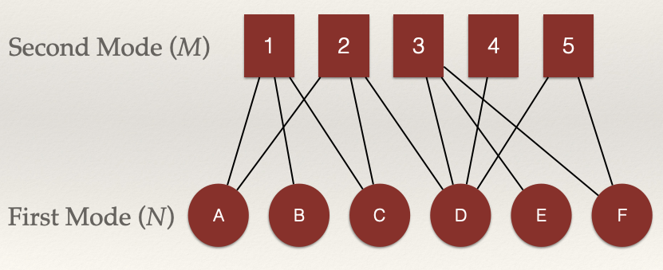

```{r setup, include=FALSE}

knitr::opts_chunk$set(
  echo = FALSE, 
  message=FALSE, 
  warning=FALSE, 
  fig.width = 10,
  fig.align = "center"
  )

library( here )      # for the directory
library( ggraph )    # for plotting
library( igraph )    # for working with graphs
library( ggplot2 )   # for plotting
library( gridExtra ) # for plotting multiple plots
library( grid )      # to include the null graphical object
library( reshape2 )  # for reshaping the matrix data for a plot

```

# Bipartite Graphs/Two-Mode Networks

In the prior chapters, we have mainly focused our attention on networks that have a single set of nodes. As discussed in the introductory chapter, these sort of graphs are referred to as *unipartite*. This term means "one partition" and is in reference to the fact that there is only one partition of the node set. But, not all of the networks you encounter as a crime analyst will be unipartite (also called "one mode"). In fact, most of the data you will examine will be more complex in how it is structured.

But, not all of the networks we want to examine have a single node set. More complex relational structures have multiple partitions of node sets (i.e. *n*-mode). **Bipartite** graphs allow us to represent networks that have two partitions of nodes. In many instances, data are structured such that nodes come from two separate classes. Some examples include:

  * Members of various groups
  * Authors of papers
  * Students in courses
  * Participants in an event

In all these examples, there are not direct ties between the nodes. For example, students who attend the same courses are not connected directly through some tie like friendship. Rather, they are connected through their shared course taking. It is the *courses* that connect them.

In contrast to *unipartite* graphs, this is a very different way of **conceptualizing** and **operationalizing** social structure. 

## Motivating Question and Empirical Example

Let's revisit an empirical question from the introductory chapter of this book:

  *What determines whether a police officer endorses the use of body-worn cameras and whether they activate their body-camera during an incident?*

Rather than focus on individual characteristics (e.g. age, experience) or situational characteristics (e.g. time of day, incident), a study by @young2015 entitled, *Diffusion of Ideas and Technology: The Role of Networks in Influencing the Endorsement and Use of On-Officer Video Cameras*, focused on the **network** among police officers. Specifically, they examined two research questions:

-   How do police officers "frame" body-worn cameras?
-   Is the meaning officers attribute to cameras created and transmitted in groups?
  
To answer these questions, they proposed the following model:  

```{r, fig.cap = "", out.width = "60%"}

```

In this model, the argued that police officers views of body-worn cameras influence whether they use their cameras in incidents. Where do these views come from? The authors proposed a *contagion* process whereby officers who shared incidents together exchanged views about the legitimacy of body-worn cameras.

Thus, the network matters!

The network @young2015 analyzed is shown below:

```{r, fig.cap = "", out.width = "60%"}

```

In this network, incidents (white circles) connect officers (squares and triangles). This is a bipartite graph because there are two sets of nodes: incidents and officers. The plot shows two types of officers, those who were in the treatment condition of the study (i.e. they were assigned a body-worn camera) and those who were in the control condition (i.e. they did not receive a camera). The focus of the study was how exposure to body-cameras during incidents influenced views, especially for those who were not assigned a camera. What @young2015 found was that officers views of body-cameras changed based on who they interacted with in the shared-incident network.

Data such as this are what we are going to examine in this chapter. By the end of this chapter, you should be able to:

-   Describe how bipartite graphs (two-mode networks) are different from unipartite graphs (one-mode networks).
-   Understand how bipartite graphs are represented in matrix form.
-   Analyze the structural properties of bipartite graphs.

## Biparite Graphs


```{r, graphs-define}

# ----
# This creates the graphs for the plots below

twomode_graph  <- graph_from_data_frame( 
  data.frame( 
    from = c( 1,2,3, 1,3,4, 4,5,6, 4,   4,6 ),
    to   = c( 7,7,7, 8,8,8, 9,9,9, 10, 11,11   ) ), 
  directed = FALSE )


!!!HERE WITH WORKING THROUGH THIS


# Set the random seed to render the same plot
set.seed( 507 )

# Set a fixed layout using the Fruchterman-Reingold layout
layout <- layout_with_fr( ugraph )
dilayout <- layout_with_fr( digraph )

# Set the labels
custom_labels <- c( "Jen","Tom","Bob","Leaf","Jim" )

# Assign the labels to the graph nodes
V( ugraph )$name <- custom_labels
V( digraph )$name <- custom_labels

```

```{r, plots-define}

# create the undirected plots
u_graph <-
  ggraph( ugraph, 
          layout = layout ) +                  
  geom_edge_link( color = "black", width = 0.8 ) +  
  geom_node_point( color = "#28a88d", size = 15 ) +
  geom_node_text( aes( label = name ), 
                 color = "black", 
                 size = 5,        
                 vjust = 0.5,     
                 hjust = 0.5 ) +
  ggtitle( "Undirected Graph" ) + 
  scale_x_continuous( expand = expansion( mult = c( 0.2, 0.2 ) ) ) +
  scale_y_continuous( expand = expansion( mult = c( 0.2, 0.2 ) ) ) +
theme_void() 


```

### Graph Notation

A **bipartite** graph has two partitions of nodes (called *modes*), and edges only occur between these partitions (i.e. not within). The definition of a bipartite graph is the following: $G = (N,M,L)$ where $G$ is the graph and is defined by:

  * Node set $N = \{n_1, n_2…, n_g\}$
  * Node set: $M = \{m_1, m_2…, m_g\}$
  * Line/Edge set: $L = \{l_1, l_2…, l_L\}$

In this definition, there are $N$ nodes in the first set, $M$ nodes in the second set, and $L$ lines/edges in the graph.

We can visualize an example as:


HERE!!!


```{r, fig.cap = "", out.width = "60%"}

```

In this example, we can define all of pieces of the graph using our definition above:

  * Node set $N = \{n_A, n_B, n_C, n_D, n_E, n_F \}$
  * Node set: $M = \{m_1, m_2, m_3, m_4, m_5 \}$
  * Line/Edge set: $L = \{l_1, l_2…, l_{12} \}$

<br>

#### Adjacency

As discussed in the chapter on [data structures for unipartite graphs](), we define two nodes, $n_i$ and $n_j$ as **adjacent** if there is a link $l_k = (n_i,n_j)$. We then went on to show that these data can be represented as an **adjacency matrix**, where each node is listed on the row and the column. The $i_{th}$ row and the $j_{th}$ column of $X_{ij}$ records the value of a tie from *i* to *j*. 

In bipartite graphs, we can also use an **adjacency matrix**. But, we have to represent the two different sets of nodes $N$ and $M$. we define two nodes from separate node sets, $n_i$ and $m_j$ as **adjacent** if there is a link $l_k = (n_i,m_j)$. The $i_{th}$ row and the $j_{th}$ column of $X_{ij}$ records the value of a tie from $n_i$ to $m_j$. Note the difference. That is, $N$ (the first mode) is listed on the **rows** and $M$ is listed on the **columns** of the adjacency matrix. As a consequence, the *order* of the matrix is $N \times M$, meaning that it has $N$ rows and $M$ columns. Thus, if the number of nodes in $N$ is not equal to the number of nodes in $M$, we have a **rectangular** matrix (as opposed to a **square** matrix when the order is equal, as with unipartite graphs).


## Case Study: Money-Laundering and Betweenness

In a case study examining the role of betweenness centrality in criminal networks, @malm2011using analyzed money-laundering to understand how different actors influenced network cohesion and resource flow. Analyzing data from intelligence reports, the authors found that the majority of money-laundering in this drug market was self-laundering (where individuals laundered their own illicit earnings), rather than employing specialized professionals. Using betweenness centrality to assess how well-positioned launderers were within the network, @malm2011using found that self-launderers generally exhibited higher betweenness centrality, showing they often acted as key brokers facilitating information flow and transactions across different parts of the network. The findings suggested that targeting individuals with high betweenness centrality, particularly those involved in self-laundering, may be most effective for disrupting drug networks.

## Betweenness Centrality Definition

*Betweenness* centrality is based on the number of <u>shortest</u> paths between two nodes, *j* and *k*, that node *i* resides on. Recall that a **path** is an edge or sequence of edges that connect two nodes and a **geodesic** is the shortest path between two nodes.

## Undirected Graphs

### Betweenness Centrality

For an undirected binary graph, betweenness centrality is:

$$C_B(n_i) = \sum\limits_{j<k} g_{jk}(n_i) / g_{jk}$$

This equation is a bit different from those for degree and closeness centrality. Let's unpack it:

-   The denominator, $g_{jk}$, is the number of geodesics linking *j* to *k*.
-   The numerator, $g_{jk}(n_i)$, is the number of geodesics linking *j* and *k* that contain *i*.\
-   Betweenness centrality is the ratio of the geodesics between *j* and *k* that contain *i*.

In words, if *j* has to go through *i* to reach *k*, $j-i-k$, then *i* will have high betweenness because *i* is **between** *j* and *k*.

Let's consider an example. Take a look at this graph:

```{r}
u_graph
```

*What are the* <u>paths</u> between Jen and Jim?

There are two:

-   Jen to Tom to Bob to Jim
-   Jen to Tom to Bob to Leaf to Jim

We can see this visually:

```{r}

# set up the colors
edge_colors1 <- c("#28a88d", "#28a88d", "grey80", "#28a88d", "grey80" )
edge_colors2 <- c("#28a88d", "#28a88d", "#28a88d", "grey80", "#28a88d" )

E( ugraph )$color1 <- edge_colors1
E( ugraph )$color2 <- edge_colors2


# do the plots
plot1 <-
  ggraph( ugraph, 
          layout = layout ) +                  
  geom_edge_link( aes( color = edge_colors1 ), width = 0.8, show.legend = FALSE ) +  
  geom_node_point( color = "#28a88d", size = 15 ) +
  geom_node_text( aes( label = name ), 
                 color = "black", 
                 size = 5,        
                 vjust = 0.5,     
                 hjust = 0.5 ) +
  ggtitle( "Jen to Tom to Bob to Jim" ) + 
  scale_x_continuous( expand = expansion( mult = c( 0.2, 0.2 ) ) ) +
  scale_y_continuous( expand = expansion( mult = c( 0.2, 0.2 ) ) ) +
  scale_edge_color_identity() +
theme_void() 

plot2 <-
  ggraph( ugraph, 
          layout = layout ) +                  
  geom_edge_link( aes( color = edge_colors2 ), width = 0.8, show.legend = FALSE ) +  
  geom_node_point( color = "#28a88d", size = 15 ) +
  geom_node_text( aes( label = name ), 
                 color = "black", 
                 size = 5,        
                 vjust = 0.5,     
                 hjust = 0.5 ) +
  ggtitle( "Jen to Tom to Bob to Leaf to Jim" ) + 
  scale_x_continuous( expand = expansion( mult = c( 0.2, 0.2 ) ) ) +
  scale_y_continuous( expand = expansion( mult = c( 0.2, 0.2 ) ) ) +
  scale_edge_color_identity() +
theme_void() 

# now plot the plots
grid.arrange( plot1, plot2, ncol = 2 )

```

Note that Bob is on both of those paths. He is *between* Jen and Jim on both paths. Note, however, that only one of the paths is a <u>geodesic path</u> (the Jen-\>Tom-\>Bob-\>Jim path). That is because it is shorter.

Now, let's calculate the betweenness centrality for Bob. The **first** thing we need to find are the geodesic paths. Then, figure out how many of those geodesic paths contain Bob. We do this be creating a table of geodesic proportions for Bob.

#### Geodesic Proportions for *Bob*

|      | Jen | Tom | Leaf |              Jim              |
|:-----|:---:|:---:|:----:|:-----------------------------:|
| Jen  |     |     |      | [/?]{style="color: #28a88d;"} |
| Tom  |     |     |      |                               |
| Leaf |     |     |      |                               |
| Jim  |     |     |      |                               |

*How many geodesics from Jen to Jim?* There is 1 geodesic from **Jen** to **Jim**. So, we would just add that to our table:

#### Geodesic Proportions for *Bob*

|      | Jen | Tom | Leaf |              Jim              |
|:-----|:---:|:---:|:----:|:-----------------------------:|
| Jen  |     |     |      | [/1]{style="color: #28a88d;"} |
| Tom  |     |     |      |                               |
| Leaf |     |     |      |                               |
| Jim  |     |     |      |                               |

Now, how many geodesics from **Jen** to **Jim** include **Bob**? Bob is <u>on</u> the *only* geodesic from Jen to Jim. So, we would just add that to our table:

#### Geodesic Proportions for *Bob*

|      | Jen | Tom | Leaf |              Jim               |
|:-----|:---:|:---:|:----:|:------------------------------:|
| Jen  |     |     |      | [1/1]{style="color: #28a88d;"} |
| Tom  |     |     |      |                                |
| Leaf |     |     |      |                                |
| Jim  |     |     |      |                                |

What about Jen to Tom?

```{r}

edge_colors1 <- c("#28a88d", "grey80", "grey80", "grey80", "grey80" )
E( ugraph )$color1 <- edge_colors1

  ggraph( ugraph, 
          layout = layout ) +                  
  geom_edge_link( aes( color = edge_colors1 ), width = 0.8, show.legend = FALSE ) +  
  geom_node_point( color = "#28a88d", size = 15 ) +
  geom_node_text( aes( label = name ), 
                 color = "black", 
                 size = 5,        
                 vjust = 0.5,     
                 hjust = 0.5 ) +
  ggtitle( "Jen to Tom" ) + 
  scale_x_continuous( expand = expansion( mult = c( 0.2, 0.2 ) ) ) +
  scale_y_continuous( expand = expansion( mult = c( 0.2, 0.2 ) ) ) +
  scale_edge_color_identity() +
theme_void() 

```

#### Geodesic Proportions for *Bob*

|      | Jen |              Tom               | Leaf | Jim |
|:-----|:---:|:------------------------------:|:----:|:---:|
| Jen  |     | [?/?]{style="color: #28a88d;"} |      | 1/1 |
| Tom  |     |                                |      |     |
| Leaf |     |                                |      |     |
| Jim  |     |                                |      |     |

There is 1 geodesic from Jen to Tom, <u>and</u> Bob is not on it. So, that is a 0 for the numerator. We can update the table accordingly:

#### Geodesic Proportions for *Bob*

|      | Jen |              Tom               | Leaf | Jim |
|:-----|:---:|:------------------------------:|:----:|:---:|
| Jen  |     | [0/1]{style="color: #28a88d;"} |      | 1/1 |
| Tom  |     |                                |      |     |
| Leaf |     |                                |      |     |
| Jim  |     |                                |      |     |

Finally, what about Jen to Leaf?

#### Geodesic Proportions for *Bob*

|      | Jen | Tom |              Leaf              | Jim |
|:-----|:---:|:---:|:------------------------------:|:---:|
| Jen  |     | 0/1 | [?/?]{style="color: #28a88d;"} | 1/1 |
| Tom  |     |     |                                |     |
| Leaf |     |     |                                |     |
| Jim  |     |     |                                |     |

Bob is on the geodesic from Jen to Leaf:

#### Geodesic Proportions for *Bob*

|      | Jen | Tom |              Leaf              | Jim |
|:-----|:---:|:---:|:------------------------------:|:---:|
| Jen  |     | 0/1 | [1/1]{style="color: #28a88d;"} | 1/1 |
| Tom  |     |     |                                |     |
| Leaf |     |     |                                |     |
| Jim  |     |     |                                |     |

Of the geodesics between $Jen,Tom$, $Jen,Leaf$, and $Jen,Tom$, how many include Bob? We just some the ratios across the row. It gives us 2.

#### Geodesic Proportions for *Bob*

|      | Jen | Tom | Leaf | Jim | **SUM** |
|:-----|:---:|:---:|:----:|:---:|:-------:|
| Jen  |     | 0/1 | 1/1  | 1/1 |  **2**  |
| Tom  |     |     |      |     |         |
| Leaf |     |     |      |     |         |
| Jim  |     |     |      |     |         |

Now, to finish our calculation for Bob, we need to calculate the geodesics for the rest of the matrix:

#### Geodesic Proportions for *Bob*

|      | Jen | Tom |              Leaf              |              Jim               |
|:-------------|:------------:|:------------:|:--------------:|:--------------:|
| Jen  |     | 0/1 |              1/1               |              1/1               |
| Tom  |     |     | [?/?]{style="color: #28a88d;"} | [?/?]{style="color: #28a88d;"} |
| Leaf |     |     |                                | [?/?]{style="color: #28a88d;"} |
| Jim  |     |     |                                |                                |

To aid in this, think about the highlighted paths below:

```{r}

edge_colors1 <- c("grey80", "#28a88d", "#28a88d","#28a88d","#28a88d" )
E( ugraph )$color1 <- edge_colors1

  ggraph( ugraph, 
          layout = layout ) +                  
  geom_edge_link( aes( color = edge_colors1 ), width = 0.8, show.legend = FALSE ) +  
  geom_node_point( color = "#28a88d", size = 15 ) +
  geom_node_text( aes( label = name ), 
                 color = "black", 
                 size = 5,        
                 vjust = 0.5,     
                 hjust = 0.5 ) +
  ggtitle( "Jen to Tom" ) + 
  scale_x_continuous( expand = expansion( mult = c( 0.2, 0.2 ) ) ) +
  scale_y_continuous( expand = expansion( mult = c( 0.2, 0.2 ) ) ) +
  scale_edge_color_identity() +
theme_void() 

```

The sum of all these ratios is Bob's betweenness centrality score:

$$C_B(Bob) = \sum\limits_{j<k} g_{jk}(Bob) / g_{jk}$$

#### Geodesic Proportions for *Bob*

|           | Jen | Tom | Leaf | Jim | **SUM** |
|:---------:|:---:|:---:|:----:|:---:|:-------:|
|    Jen    |     | 0/1 | 1/1  | 1/1 |  **2**  |
|    Tom    |     |     | 1/1  | 1/1 |  **2**  |
|   Leaf    |     |     |      | 0/1 |  **0**  |
|    Jim    |     |     |      |     |         |
| **TOTAL** |     |     |      |     |  **4**  |

That sum is 4. Bob's betweenness centrality score is 4. What does this mean? A score of 4 indicates that Bob occupies a position between two nodes on 4 of the geodesics in the graph.

*What about Leaf?* We can do the same thing by creating a table of geodesic proportions for *Leaf*.

#### Geodesic Proportions for *Leaf*

|           | Jen | Tom | Bob | Jim | **SUM** |
|:---------:|:---:|:---:|:---:|:---:|:-------:|
|    Jen    |     | ?/? | ?/? | ?/? |  **?**  |
|    Tom    |     |     | ?/? | ?/? |  **?**  |
|    Bob    |     |     |     | ?/? |  **?**  |
|    Jim    |     |     |     |     |         |
| **TOTAL** |     |     |     |     |  **?**  |

```{r}
u_graph
```

Based on the plot, we can visually see that Leaf's betweenness is going to be zero as he is not on any paths to between two nodes. We can show this mathematically in the table:

#### Geodesic Proportions for *Leaf*

|           | Jen | Tom | Bob | Jim | **SUM** |
|:---------:|:---:|:---:|:---:|:---:|:-------:|
|    Jen    |     | 0/1 | 0/1 | 0/1 |  **0**  |
|    Tom    |     |     | 0/1 | 0/1 |  **0**  |
|    Bob    |     |     |     | 0/1 |  **0**  |
|    Jim    |     |     |     |     |         |
| **TOTAL** |     |     |     |     |  **0**  |

Based on the visual inspection of the plot, can you find two other nodes who will have a betweenness centrality score of 0?

The complete scores are:

| Node | Betweenness |
|:----:|:-----------:|
| Jen  |      0      |
| Tom  |      3      |
| Bob  |      4      |
| Leaf |      0      |
| Jim  |      0      |

### Standardization

As discussed in the prior chapters, centrality measures are sensitive to the size of the graph, *g*. In the case of *betweenness* centrality, having to sum over more nodes will make scores from large networks bigger than scores from smaller networks (because you are just summing over more nodes). This means that we can't compare betweenness centrality scores across graphs of different sizes. *Solution*?

Standardize! If we want to compare nodes in different sized graphs, then we just take into account the number of nodes and the maximum possible nodes to which *i* could be connected. For betweenness centrality, we have to go a step further. We need to account for the number of pairs of nodes that do not include *i*. In an undirected graph, this is $(g-1))(g-2)/2$.

Thus, we can calculate a standardized betweenness centrality score for an undirected graph as:

$$C'_B(n_i) = \frac{\sum\limits_{j<k} g_{jk}(n_i) / g_{jk}}{[(g-1)(g-2)/2]} =  \frac{C_B(n_i)}{[(g-1)(g-2)/2]}$$

So, all we are doing is adjusting each betweenness score by $(g-1))(g-2)/2$.

For this graph, the denominator, $(g-1))(g-2)/2=(5-1))(5-2)/2 = 6$. Plugging that in we get: $$C'_B(n_i) = \frac{C_B(n_i)}{6}$$.

When we calculate the *raw* betweenness scores, we get the following table:

| Node | Betweenness | Standardized Betweenness |
|:----:|:-----------:|:------------------------:|
| Jen  |      0      |      0 / 6 = 0.000       |
| Tom  |      3      |      3 / 6 = 0.500       |
| Bob  |      4      |      4 / 6 = 0.667       |
| Leaf |      0      |      0 / 6 = 0.000       |
| Jim  |      0      |      0 / 6 = 0.000       |

### Betweenness Centralization

As we did with *degree centralization* and *closeness centralization*, we can calculate the betweenness centralization of the graph. Recall that centralization measures the extent to which the nodes in a social network differ from one another in their individual centrality scores. Put differently, how much variation is there in the distribution of centrality scores? As with closeness centralization, we use the *standardized* betweenness score (as opposed to the *raw* score).

We can calculate betweenness centralization as:

$$C_B = \frac{\sum\limits_{i=1}^g[C'_B(n^*)-C'_B(n_i)]}{(g-1)} $$

If I lost you in some of the math, don't worry. Let's calculate the betweenness centralization score for our example graph. Recall our table of standardized betweenness scores:

| Node | Betweenness | Standardized Betweenness |
|:----:|:-----------:|:------------------------:|
| Jen  |      0      |      0 / 6 = 0.000       |
| Tom  |      3      |      3 / 6 = 0.500       |
| Bob  |      4      |      4 / 6 = 0.667       |
| Leaf |      0      |      0 / 6 = 0.000       |
| Jim  |      0      |      0 / 6 = 0.000       |

*What is the largest standardized betweenness score?* It is 0.667 for Bob. Also, we have $g-1 = 5 - 1 = 4$. Now, we just plug these into our equation:

$$C_B = \frac{\sum\limits_{i=1}^g[0.667-C'_B(n_i)]}{4} $$

| Node | Betweenness | Standardized Betweenness | Deviations of Betweenness Closeness, $0.667-C'_B(n_i)$ |
|:-------------:|:-------------:|:-------------:|:---------------------------:|
| Jen  |      0      |      0 / 6 = 0.000       |                 0.667 - 0.000 = 0.667                  |
| Tom  |      3      |      3 / 6 = 0.500       |                 0.667 - 0.500 = 0.167                  |
| Bob  |      4      |      4 / 6 = 0.667       |                 0.667 - 0.667 = 0.000                  |
| Leaf |      0      |      0 / 6 = 0.000       |                 0.667 - 0.000 = 0.667                  |
| Jim  |      0      |      0 / 6 = 0.000       |                 0.667 - 0.000 = 0.667                  |

If we total all of the values in the last column we get 2.168. Plugging this in as our numerator, we get:

$$C_B = \frac{2.168}{4} = 0.542$$

So, the betweenness centralization score for our example graph is 0.542. *What does this mean?*

When betweenness centrality is evenly dispersed, meaning that all nodes have the same betweenness score, then the numerator in the equation will be zero and the quotient will be close to 0. When there is considerable inequality in the betweenness centrality scores between nodes, the quotient will be closer to 1. Thus, closer to 1 indicates that the graph is hierarchically structured and closer to 0 means that the graph is more decentralized.

We can see this by examining two additional undirected networks:

```{r}
grid.arrange( star_graph, nullGrob(), circle_graph, ncol = 3, widths = c( 1, 0.2, 1 ) )
```

The betweenness centralization score for the figure on the left is 1, whereas the betweenness centralization score for the figure on the right is 0. This makes sense. In the figure on the left, every node has to go <u>between</u> the node in the middle. The node in the middle is on every geodesic in the graph. In contrast, for the graph on the right, every node has a betweenness centrality score of 1, so ther is no variation in betweenness centrality scores.

## Directed Graphs

As we have seen, when we have a directed graph, we have to consider directionality when evaluating a centrality measure. If we are interested in the betweenness score for Bob, we would do the same thing: create a geodesic proportions table for Bob. The difference is that we want to consider the directionality.

Let's take the example that we have been working with for directed graphs and change the layout of the edges slightly (the sociomatrix is the same, just curving the edges in the plot). *Is Bob on the geodesic between Jen and Jim? Jen and Leaf? Jen and Tom?* Let's take a look.

```{r}

edge_colors1 <- rep( "grey80", 8 )
edge_colors1[ c( 1:4 ) ] <- "#1f0321"
E( digraph )$color1 <- edge_colors1

ggraph( digraph, 
          layout = dilayout ) +                  
  geom_node_point( color = "#fc23fc", size = 15 ) +
  geom_node_text( aes( label = name ), 
                 color = "black", 
                 size = 5,        
                 vjust = 0.5,     
                 hjust = 0.5) +
  geom_edge_arc( aes( start_cap = label_rect( node1.name ), 
                    end_cap = circle( 5, 'mm' ),
                    color = edge_colors1 ), 
                arrow = arrow( length = unit( 0.02, "npc" ) ), 
                width = 0.8,
                show.legend = FALSE,
                curvature = 0.18 ) +
  ggtitle( "Directed Graph" ) + 
  scale_x_continuous( expand = expansion( mult = c( 0.2, 0.2 ) ) ) +
  scale_y_continuous( expand = expansion( mult = c( 0.2, 0.2 ) ) ) +
  scale_edge_color_identity() +
  theme_void()  

```

*Is Bob on the geodesic between Jen and Jim?* Yes! Bob is on the geodesic between Jen and Jim. *Is Bob on the geodesic between Jen and Leaf?* Yes. *Jen and Tom?* No.

As before, we can put this information in a table of geodesic proportions:

#### Geodesic Proportions for *Bob*

|      | Jen | Tom | Leaf | Jim |
|:-----|:---:|:---:|:----:|:---:|
| Jen  |     | 0/1 | 1/1  | 1/1 |
| Tom  |     |     | 1/1  | 1/1 |
| Leaf |     |     |      | 0/1 |
| Jim  |     |     |      |     |

Are we done? Not quite yet. Since the graph is **directed** we have to total *all* the rows. The reasons we did not do this for **undirected** graph is because the adjacency matrix is symmetric. Since the matrix for an undirected graph is not symmetric, we have to think of all the ties. Recall from our discussion about adjacency matrices for directed graphs, the rows tell us about outgoing ties or sending whereas the columns tell us about incoming ties or receiving. So, we will need information for the <u>complete</u> table.

*Why?* Well, think about the table below:

#### Geodesic Proportions for *Bob*

|           | Jen | Tom | Leaf | Jim | **SUM** |
|:---------:|:---:|:---:|:----:|:---:|:-------:|
|    Jen    |     | 0/1 | 1/1  | 1/1 |  **2**  |
|    Tom    |     |     | 1/1  | 1/1 |  **2**  |
|   Leaf    |     |     |      | 0/1 |  **0**  |
|    Jim    |     |     |      |     |         |
| **TOTAL** |     |     |      |     |  **4**  |

If we sum this, we get 4. But, note that this does not account for *all* of the edges in the network. We need to complete the matrix:

#### Geodesic Proportions for *Bob*

|           | Jen | Tom | Leaf | Jim | **SUM** |
|:---------:|:---:|:---:|:----:|:---:|:-------:|
|    Jen    |     | 0/1 | 1/1  | 1/1 |  **2**  |
|    Tom    | ?/? |     | 1/1  | 1/1 |  **2**  |
|   Leaf    | ?/? | ?/? |      | 0/1 |  **0**  |
|    Jim    | ?/? | ?/? | ?/?  |     |         |
| **TOTAL** |     |     |      |     |  **4**  |

To better see this, let's highlight the other edges that we did not focus on above:

```{r}

edge_colors1 <- rep( "grey80", 8 )
edge_colors1[ c( 5:8 ) ] <- "#1f0321"
E( digraph )$color1 <- edge_colors1

ggraph( digraph, 
          layout = dilayout ) +                  
  geom_node_point( color = "#fc23fc", size = 15 ) +
  geom_node_text( aes( label = name ), 
                 color = "black", 
                 size = 5,        
                 vjust = 0.5,     
                 hjust = 0.5) +
  geom_edge_arc( aes( start_cap = label_rect( node1.name ), 
                    end_cap = circle( 5, 'mm' ),
                    color = edge_colors1 ), 
                arrow = arrow( length = unit( 0.02, "npc" ) ), 
                width = 0.8,
                show.legend = FALSE,
                curvature = 0.18 ) +
  ggtitle( "Directed Graph" ) + 
  scale_x_continuous( expand = expansion( mult = c( 0.2, 0.2 ) ) ) +
  scale_y_continuous( expand = expansion( mult = c( 0.2, 0.2 ) ) ) +
  scale_edge_color_identity() +
  theme_void()  

```

We can know complete our table:

#### Geodesic Proportions for *Bob*

|           | Jen | Tom | Leaf | Jim | **SUM** |
|:---------:|:---:|:---:|:----:|:---:|:-------:|
|    Jen    |     | 0/1 | 1/1  | 1/1 |  **2**  |
|    Tom    | 0/0 |     | 1/1  | 1/1 |  **2**  |
|   Leaf    | 0/0 | 0/0 |      | 0/1 |  **0**  |
|    Jim    | 0/0 | 0/0 | 0/1  |     |         |
| **TOTAL** |     |     |      |     |  **4**  |

*Why are there no geodesics in the lower portion of the table?* Take a look at the plot. Can Tom does not send a tie to Jen, so there is not a geodesic from Tom to Jen. This is the same for Leaf to Jen. There *is* a geodesic from Jim to Leaf, but Bob is not on it. As a consequence, the total is 4.

Go ahead and compute the betweenness scores for the rest of the nodes in the network. You should get this:

| Node | Betweenness |
|:----:|:-----------:|
| Jen  |      0      |
| Tom  |      3      |
| Bob  |      4      |
| Leaf |      0      |
| Jim  |      0      |

### Standardization

We can calculate a standardized betweenness centrality score for a directed graph as:

$$C'_B(n_i) = \frac{\sum\limits_{j<k} g_{jk}(n_i) / g_{jk}}{[(g-1)(g-2)]} =  \frac{C_B(n_i)}{[(g-1)(g-2)]}$$

So, all we are doing is adjusting each betweenness score by $(g-1))(g-2)$.

For this graph, the denominator, $(g-1))(g-2)/2=(5-1))(5-2) = 12$. Plugging that in we get: $$C'_B(n_i) = \frac{C_B(n_i)}{12}$$.

When we calculate the *raw* betweenness scores, we get the following table:

| Node | Betweenness | Standardized Betweenness |
|:----:|:-----------:|:------------------------:|
| Jen  |      0      |      0 / 12 = 0.000      |
| Tom  |      3      |      3 / 12 = 0.250      |
| Bob  |      4      |      4 / 12 = 0.333      |
| Leaf |      0      |      0 / 12 = 0.000      |
| Jim  |      0      |      0 / 12 = 0.000      |

### Betweenness Centralization

For a directed graph, we can use the following to calculate betweenness centralization (it is the same equation as above for the undirected graph):

$$C_B = \frac{\sum\limits_{i=1}^g[C'_B(n^*)-C'_B(n_i)]}{(g-1)} $$

If I lost you in some of the math, don't worry. Let's calculate the betweenness centralization score for our example graph. Recall our table of standardized betweenness scores:

| Node | Betweenness | Standardized Betweenness |
|:----:|:-----------:|:------------------------:|
| Jen  |      0      |      0 / 12 = 0.000      |
| Tom  |      3      |      3 / 12 = 0.250      |
| Bob  |      4      |      4 / 12 = 0.333      |
| Leaf |      0      |      0 / 12 = 0.000      |
| Jim  |      0      |      0 / 12 = 0.000      |

*What is the largest standardized betweenness score?* It is 0.333 for Bob. Also, we have $g-1 = 5 - 1 = 4$. Now, we just plug these into our equation:

$$C_B = \frac{\sum\limits_{i=1}^g[0.333-C'_B(n_i)]}{4} $$

| Node | Betweenness | Standardized Betweenness | Deviations of Betweenness Closeness, $0.667-C'_B(n_i)$ |
|:-------------:|:-------------:|:-------------:|:---------------------------:|
| Jen  |      0      |      0 / 12 = 0.000      |                 0.333 - 0.000 = 0.333                  |
| Tom  |      3      |      3 / 12 = 0.250      |                 0.333 - 0.250 = 0.083                  |
| Bob  |      4      |      4 / 12 = 0.333      |                 0.333 - 0.333 = 0.000                  |
| Leaf |      0      |      0 / 12 = 0.000      |                 0.333 - 0.000 = 0.333                  |
| Jim  |      0      |      0 / 12 = 0.000      |                 0.333 - 0.000 = 0.333                  |

If we total all of the values in the last column we get 1.082. Plugging this in as our numerator, we get:

$$C_B = \frac{1.082}{4} = 0.271$$

#### Centralization Comparison

We can now compare four different centralization scores for this directed graph: indegree, outdegree, closeness, and betweenness. The scores are:

|             | Centralization |
|:-----------:|:--------------:|
|  Indegree   |     0.438      |
|  Outdegree  |     0.125      |
|  Closeness  |     0.555      |
| Betweenness |     0.271      |

What can we say about the closeness centralization scores for each type of centrality? (take a look at the graph if that helps)

```{r}
d_graph
```

## Test your Knowledge

-   What distinguishes betweenness centrality from other types of centrality like degree and closeness?
-   How does betweenness centrality help identify key actors in criminal networks, such as those in organized crime?
-   Why might law enforcement focus on individuals with high betweenness centrality when disrupting criminal networks?
-   What are the steps to calculate betweenness centrality for a specific node within an undirected network?
-   Why is it necessary to standardize betweenness centrality when comparing scores across networks of different sizes?
-   How does the calculation of betweenness centrality change when working with directed graphs compared to undirected graphs?
-   Why must you account for directionality when evaluating centrality measures in directed graphs?
-   What does a high betweenness centralization score indicate about the structure of a network? A low score?

## Summary

This chapter explored the concept of betweenness centrality as a measure of centrality within social networks, emphasizing its role in identifying actors who bridge disconnected network segments and influence information flow. Unlike degree or closeness centrality, betweenness highlights actors who control connectivity between groups, making it particularly valuable in analyzing criminal networks, where key figures often facilitate collaboration. We covered how to calculate betweenness centrality for individual nodes, standardize these scores for comparison across network sizes, and compute a network-wide betweenness centralization score, which reveals the structural cohesion of a network. Understanding these concepts equips analysts to assess both individual influence and the overall structure of networks.

We have now covered three different ways of conceptualizing centrality: degree, closeness, and betweenness. These are all valuable tools for your crime analyst toolkit!
