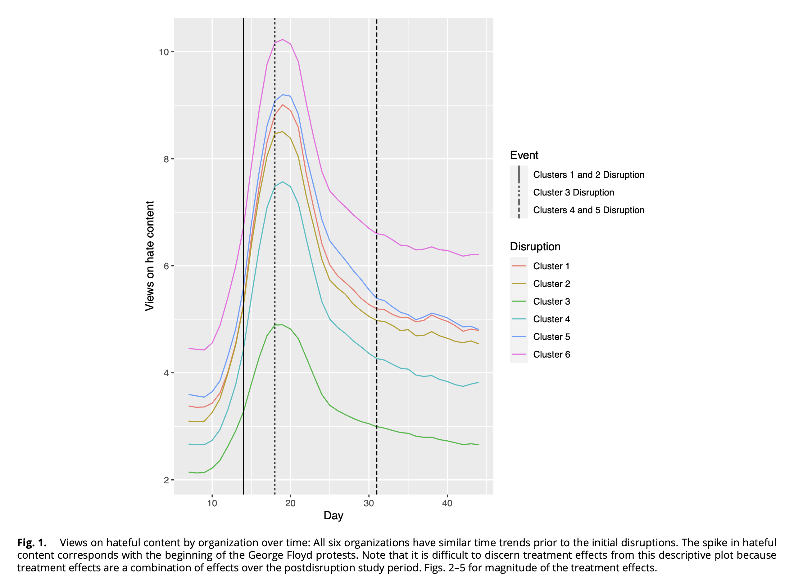

```{r setup, include=FALSE}

knitr::opts_chunk$set(
  echo = FALSE, 
  message=FALSE, 
  warning=FALSE, 
  fig.width = 10,
  fig.align = "center"
  )

library( here )      # for the directory
library( ggraph )    # for plotting
library( igraph )    # for working with graphs
library( ggplot2 )   # for plotting
library( gridExtra ) # for plotting multiple plots
library( grid )      # to include the null graphical object
library( reshape2 )  # for reshaping the matrix data for a plot

```

```{r, graphs-define}

# ----
# This creates the graphs for the plots below

# Create the graph objects
ugraph  <- graph_from_data_frame( 
  data.frame( 
    from = c( 1, 2, 3, 3, 4 ),
    to   = c( 2, 3, 4, 5, 5 ) ), 
  directed = FALSE )

digraph  <- graph_from_data_frame( 
  data.frame( 
    from = c( 1, 2, 3, 3, 4, 4, 5, 5  ),
    to   = c( 2, 3, 4, 5, 3, 5, 3, 4  ) ), 
  directed = TRUE )

star_net <- graph_from_data_frame(
  data.frame(
    from = c( 1, 1, 1, 1 ),
    to   = c( 2, 3, 4, 5 ) ),
  directed = FALSE )

circle_net <- graph_from_data_frame(
  data.frame(
    from = c( 1, 2, 3, 4, 5 ),
    to   = c( 2, 3, 4, 5, 1 ) ),
  directed = FALSE )

# Set the random seed to render the same plot
set.seed( 507 )

# Set a fixed layout using the Fruchterman-Reingold layout
layout <- layout_with_fr( ugraph )
dilayout <- layout_with_fr( digraph )

starlayout <- layout_with_fr( star_net )
circlelayout <- layout_with_fr( circle_net )


# Set the labels
custom_labels <- c( "Jen","Tom","Bob","Leaf","Jim" )

# Assign the labels to the graph nodes
V( ugraph )$name <- custom_labels
V( digraph )$name <- custom_labels

```

```{r, plots-define}

# create the undirected graph
u_graph <-
  ggraph( ugraph, 
          layout = layout ) +                  
  geom_edge_link( color = "black", width = 0.8 ) +  
  geom_node_point( color = "#28a88d", size = 15 ) +
  geom_node_text( aes( label = name ), 
                 color = "black", 
                 size = 5,        
                 vjust = 0.5,     
                 hjust = 0.5 ) +
  ggtitle( "Undirected Graph" ) + 
  scale_x_continuous( expand = expansion( mult = c( 0.2, 0.2 ) ) ) +
  scale_y_continuous( expand = expansion( mult = c( 0.2, 0.2 ) ) ) +
theme_void() 

# create the directed graph
d_graph <- 
  ggraph( digraph, 
          layout = dilayout ) +                  
  geom_node_point( color = "#fc23fc", size = 15 ) +
  geom_node_text( aes( label = name ), 
                 color = "black", 
                 size = 5,        
                 vjust = 0.5,     
                 hjust = 0.5) +
  geom_edge_link( aes( start_cap = label_rect( node1.name ), 
                     end_cap = circle( 5, 'mm' ) ),
                 arrow = arrow( length = unit( 0.02, "npc" ) ), 
                 color = "black", width = 0.8) +
  ggtitle( "Directed Graph" ) + 
  scale_x_continuous( expand = expansion( mult = c( 0.2, 0.2 ) ) ) +
  scale_y_continuous( expand = expansion( mult = c( 0.2, 0.2 ) ) ) +
  theme_void()  

```

# Centrality

When we say a *node* is "central", what do we mean conceptually? As a crime analyst, you probably already know that identifying and understanding who holds the most influence within a group is crucial for effective intervention. For example, in a study of white-collar crime networks, @smith2012corporatefraud identified individuals most connected to others in a corporate fraud scheme, revealing key facilitators who had a disproportionate influence over the flow of information and resources. This allowed the researchers to pinpoint the central figures within the fraud ring, enabling targeted investigative efforts. This chapter will guide you through the conceptualization of **centrality** as it pertains to *degree* centrality, demonstrating how to calculate degree centrality scores for individual nodes and how to assess the overall degree centralization of an entire network. By gaining a conceptual understanding of centrality, and understanding the operationalization of centrality through degree centrality, crime analysts can more effectively identify key targets for investigation and disruption in criminal organizations.

By the end of this chapter, you should be able to:

-   Explain the conceptualization of "centrality" as it pertains to *degree centrality*.
-   Calculate degree centrality scores for a set of nodes.
-   Calculate a degree centralization score for a graph.

## Case Study: Disrupting Hate Speech Online

As has been noted by many concerned citizens and scholars, hate speech in online forums has become a salient issue. If you are an organization who hosts such sites, what can you do to reduce hate speech? One approach is to "deplatform" particular individuals. This approach is a type of *strategic network disruption* whereby select individuals are removed from the network with the goal of reducing hate speech among those who are still using the platform. The logic is that these individuals are critical links that connect others and their absence will reduce hateful content. Does it work?

This is the question that Daniel Thomas and Laila Wahedi sought to address in the article [Disrupting Hate: The Effect of Deplatforming Hate Organizations
on their Online Audience](https://www.pnas.org/doi/full/10.1073/pnas.2214080120). They identified hate organizations on Facebook and evaluated whether removing central individuals reduced hate speech in those organizations. 

```{r, fig.cap = "", out.width = "70%", fig.align="center"}

```

Yes! As shown in the figure above (by the way, this is [Figure 1](https://www.pnas.org/doi/full/10.1073/pnas.2214080120) from the article), the authors found that hate speech declined in the organizations after the intervention. The overall finding is that deplatforming can be effective at reducing online hate speech. For our purposes here, it illustrates the role that centrality plays in thinking about networks. The authors examined a situation where central actors were removed as an intervention.

Now, let's start from the beginning and really be precise with our thinking about *centrality*.


## Test your Knowledge

-   ?

## Summary

In the next chapter we will focus on a different conceptualization and operationalization of centrality: *closeness*.
