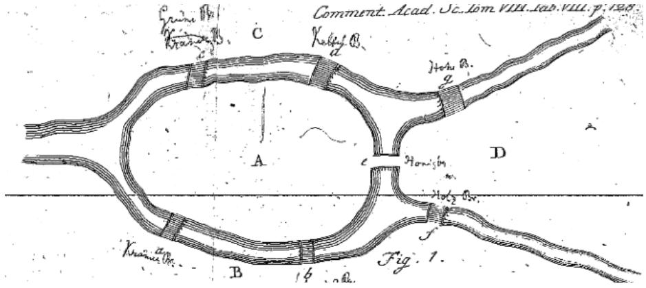

```{r setup, include=FALSE}

knitr::opts_chunk$set(
  echo = FALSE, 
  message=FALSE, 
  warning=FALSE, 
  fig.width = 10,
  fig.align = "center"
  )

library( here )      # for the directory
library( ggraph )    # for plotting
library( igraph )    # for working with graphs
library( ggplot2 )   # for plotting
library( gridExtra ) # for plotting multiple plots
library( grid )      # to include the null graphical object

```

# Network Data Structures

So far...

-   By the end of the chapter, be able to answer these questions:

    -   How can we represent networks using graphs and graph notation?
    -   How can we represent undirected and directed networks using matrices?

## Motivating Problem

Review the figure below, and consider the following problem: Devise a route in which you could cross all seven bridges.

```{r, fig.cap = "", out.width = "60%"}

```

*Now*, consider a different problem: Devise a route in which you could cross all seven bridges, **but** crossing each of the seven bridges <u>only once</u>.

**Did you figure it out?**

### Konigsberg Bridge Problem

Leonard Euler worked on this problem in the mid 18th century, eventually representing the solution with a set of points and lines. For a great overview fo the problem (and some interesting history), check out this [video](https://www.youtube.com/watch?v=nZwSo4vfw6c).

Recall the discussion from the [Introduction to Social Network Analysis for Crime Analysts]() chapter the importance of conceptualizing and operationalizing concepts in network science. *Graph theory* provides a foundation for operationalizing concepts of interest among network scientists.

## Graph Notation

Definition of a *graph* is $G = (N,L)$, where $N = {n_1, n_2..., n_g}$ defines the set of nodes and $L = {l_1, l_2..., l_L}$ defines the set of edges. This definition simply states that there are $N$ nodes and $L$ edges in a graph.

Two nodes, $n_i$ and $n_j$ are called **adjacent** if the line $l_k = (n_i, n_j)$. What this means is that in the graph, there exists a line between nodes *i* and *j*.

### Node Sets

As discussed in the "Basic Data Elements" section of the [Introduction to Social Network Analysis for Crime Analysts]() chapter, the directionality of of graph indicates whether the edges are **undirected** or **directed**. In an **undirected** graph, the order of the nodes does not matter. In other words, $l_k = (n_i, n_j) = (n_j, n_i)$. This is to say that if there exists a line between nodes *i* and *j*, then a line exists between *j* and *i*. (This may seem obvious, but will make more sense why we talk about it this way when we get to **directed** graphs.)

### Adjacency

Two nodes, $n_i$ and $n_j$ are **adjacent** if the link $l_k = (n_i,n_j)$. This is to say that in the graph, there exists an edge between nodes *i* and *j*. For a set of relations, $X$, we can define a matrix which represents these relations. We commonly use an **adjacency matrix**, where each node is listed on the row and the column. The $i_{th}$ row and the $j_{th}$ column of $X_{ij}$ records the value of a tie from *i* to *j*. In this approach, $X$, can be thought of as a variable. The presence or absence of values in the cells represent variation.

Here are some important definitions that we will come across as we talk about network data structures:

-   Scalar: a single number
-   Column vector: a column of numbers
-   Row vector: a row of numbers
-   Matrix: a rectangular array of numbers
-   Order: number of rows and columns defining the matrix
-   Square matrix: number of rows and columns of matrix are equal

#### Undirected, Binary Graphs

A plot of a network is sometimes referred to as a *sociogram*. Here is a sociogram for an undirected network where the ties are represented as zeros and ones:

```{r}

# ----
# This creates the graphs for the plots below

# Create the graph objects
graph  <- graph_from_data_frame( 
  data.frame( 
    from = c( 1, 2, 3, 3, 4 ),
    to   = c( 2, 3, 4, 5, 5 ) ), 
  directed = FALSE )

digraph  <- graph_from_data_frame( 
  data.frame( 
    from = c( 1, 2, 3, 3, 4, 4, 5, 5  ),
    to   = c( 2, 3, 4, 5, 3, 5, 3, 4  ) ), 
  directed = TRUE )

# Set the random seed to render the same plot
set.seed( 507 )

# Set a fixed layout using the Fruchterman-Reingold layout
layout <- layout_with_fr( graph )
dilayout <- layout_with_fr( digraph )

# Set the labels
custom_labels <- c( "Jen","Tom","Bob","Leaf","Jim" )

# Assign the labels to the graph nodes
V( graph )$name <- custom_labels
V( digraph )$name <- custom_labels

```

```{r, fig.height=5, fig.width=5}

ggraph( graph, 
        layout = layout ) +                  
  geom_edge_link(color = "black", width = 0.8) +  
  geom_node_point(color = "skyblue", size = 15) +  # Increase node size
  geom_node_text(aes(label = name), 
                 color = "black",                  # Label color
                 size = 5,                         # Label size
                 vjust = 0.5,                      # Vertical alignment (center)
                 hjust = 0.5) +
  theme_void() 

```

We can represent the graph as a matrix using an adjacency matrix (sometimes called a *sociomatrix*):

HERE!!!

```{r, fig.cap = "", out.width = "40%"}
knitr::include_graphics( "images/ch-04-matrix-01.jpeg" )
```

<br>

In most instances, we do not allow self-nominations, so the diagonal of the matrix is usually undefined or set to zero. In networks that allow self-nominations, you can have values on the diagonal. These are referred to as loops.

```{r, fig.cap = "", out.width = "40%"}
knitr::include_graphics( "images/ch-04-matrix-02.jpeg" )
```

<br>

In the first row, *i* sends to the second row only: $X_{12}=1; X_{15}=0$ (where $X_{ij}$ refers to the ith row and the jth column of the matrix).

```{r, fig.cap = "", out.width = "60%"}
knitr::include_graphics( "images/ch-04-matrix-03.jpeg" )
```

<br>

Since this graph is *undirected*, it is **symmetric** about the diagonal. This means that $X_{ij} = X_{ji}$ or that the *jith* column is the transposition of the *ith* row, as shown in the figure.

```{r, fig.cap = "", out.width = "60%"}
knitr::include_graphics( "images/ch-04-matrix-04.jpeg" )
```

<br>

Now, what does the rest of the matrix look like? Fill in the values in the matrix based on the graph.

```{r, fig.cap = "", out.width = "60%"}
knitr::include_graphics( "images/ch-04-matrix-05.jpeg" )
```

<br>

Done? It should look like this:

```{r, fig.cap = "", out.width = "60%"}
knitr::include_graphics( "images/ch-04-matrix-06.jpeg" )
```

<br>

Note that I added zeros to the diagonal. As we will see later, we want these values defined for working with the matrix in a software program.

The highlighted section here is called the **lower triangle** of the matrix. The *sum* of the lower triangle should equal the number of edges in the graph.

```{r, fig.cap = "", out.width = "40%"}
knitr::include_graphics( "images/ch-04-matrix-07.jpeg" )
```

<br>

The other highlighted section here is called the **upper triangle** of the matrix. The *sum* of the upper triangle should also equal the number of edges in the graph.

```{r, fig.cap = "", out.width = "40%"}
knitr::include_graphics( "images/ch-04-matrix-08.jpeg" )
```

<br>

Alternatively, we could sum all the elements and divide by 2.

<br>

#### Directed, Binary Graphs

In a **directed** graph, the order of the nodes <u>does</u> matter. Specifically, $l_k1 = (n_i, n_j) \neq (n_j, n_i) = l_k2$.

```{r, echo=FALSE, eval=TRUE, fig.width=5, fig.height=5, fig.show="show", fig.align="center"}

par( mar=c( 1, 0.1, 1, 0.1 ) )

set.seed( 19141 )

gplot( d.mat, 
       gmode = "digraph",
       vertex.cex=3, 
       vertex.col = "orange", 
       displaylabels = TRUE, 
       label.pos=5, 
       label.cex = 1 )

```

What is different in our matrix when the graph is directed?

```{r, fig.cap = "", out.width = "40%"}
knitr::include_graphics( "images/ch-04-matrix-01.jpeg" )
```

<br>

In the first row, *i* sends to the second row: $X_{12}=1$.

```{r, fig.cap = "", out.width = "60%"}
knitr::include_graphics( "images/ch-04-matrix-09.jpeg" )
```

<br>

But, in the second row, *j* does not send $X_{21}=0$. The Jen/Tom dyad is **asymmetric**. Directed graphs permit this asymmetric because $l_k1 = (n_i, n_j) \neq (n_j, n_i) = l_k2$.

```{r, fig.cap = "", out.width = "60%"}
knitr::include_graphics( "images/ch-04-matrix-10.jpeg" )
```

<br>

What about the Leaf/Bob dyad? Is it *asymmetric* or is it *symmetric*?

```{r, fig.cap = "", out.width = "60%"}
knitr::include_graphics( "images/ch-04-matrix-11.jpeg" )
```

<br>

Now, what does the rest of the matrix look like? Fill in the values in the matrix based on the graph.

```{r, fig.cap = "", out.width = "60%"}
knitr::include_graphics( "images/ch-04-matrix-12.jpeg" )
```

<br>

Done? It should look like this:

```{r, fig.cap = "", out.width = "60%"}
knitr::include_graphics( "images/ch-04-matrix-13.jpeg" )
```

<br>

Note that, because we are allowing directionality to matter, the total number of edges in the network is just the sum of the entire matrix.

## Test your Knowledge

-   Compare and contrast observational data, archival data, and questionnaire-based data collection methods for social networks. For each, provide an example that you may encounter as a crime analyst.
-   Explain the concept of boundary specification in network data collection. Why is it important to define clear boundaries, and what challenges might arise when defining them in crime network analysis?
-   Find a study or research report using network data on a topic that interests you. Then, reflect on the issues of domain, sample, temporality, tie meaning, and instrument.

## Summary

This chapter has provided a brief introduction to network data collection in the context of crime analysis, focusing on the practical methods of gathering and analyzing network data. In the next chapter, we will cover the basics of what network data are and how we go about actually doing network analysis!
